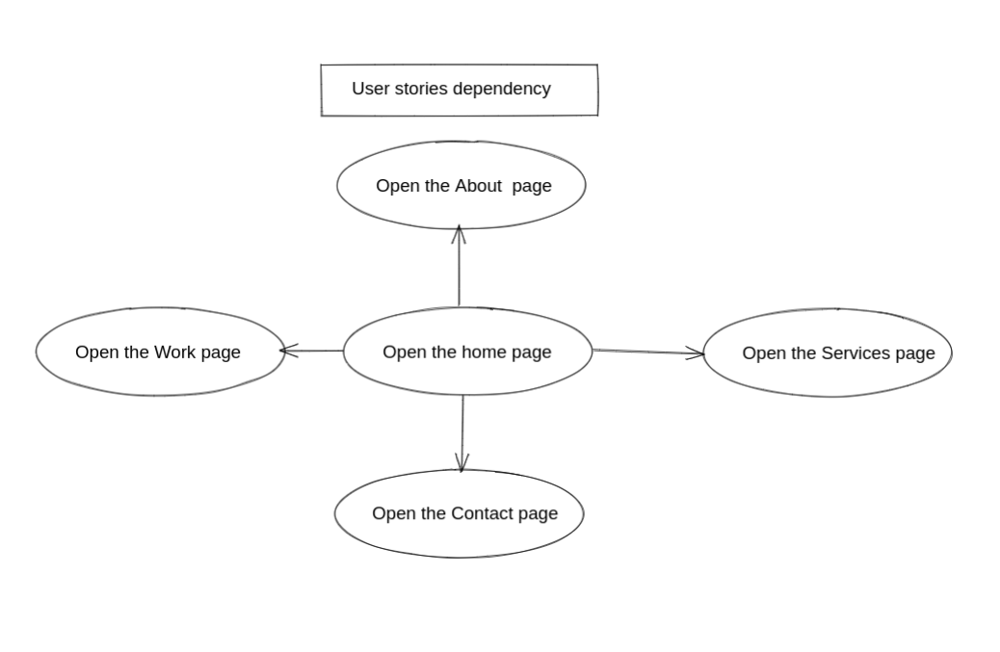
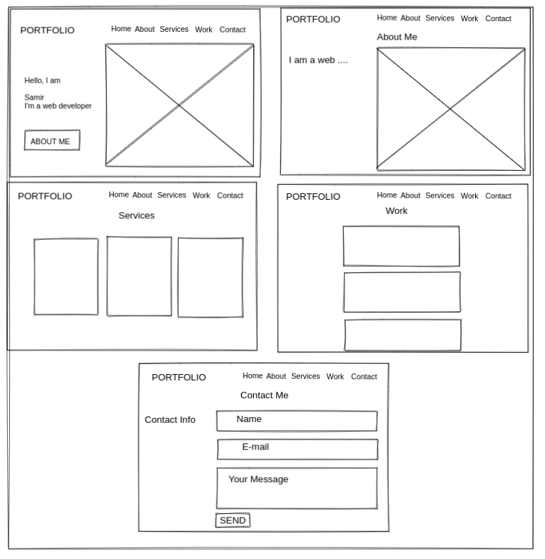

# Portfolio

---

## Data

> describe the data used in your project.
>
> - what properties?
> - what types?
> - what are array entries like?

#### Data are an object contains {id , name , url } of the projects on GitHub

---

## User Story Dependencies

---

## WIREFRAME

## 

## 0.Setup

- clone the template repo `starter-classes`
- turn on GitHub pages.
- write the strategy plan.
- Design a simple wireframe to set guidelines for UI/UX design.
- a simple `README.md`

---

## 1. home section

**As a user I want to see the portfolio owner website**

- **When I open the website , I see:**

### REPO

- This user story is developed on branch `1-home`.
- This branch is merged to `master` branch after completion.

### Task A

`index.html` :

- this issue developed on a branch `1-home`.
- add `header` with `logo` and `navigation-bar` .
- add `section` with `id=home` and add `div` child with `h2`,`h3` and `a` tag.

### Task B

`style.css`

- this issue developed on a branch `1-home`.
- import google `fonts`.
- add general style padding, margin, font family , scroll behavior
- `header `add display, position, padding and width.
- `logo` add color , font-size, font weight,...
- `ul` add position and display
- `li` add position and list style
- `a` add position and list style , margin , color
- `a` hover add color
- `home` section(class) add position, background, display,
- `home` section h2 add font size , color
- `home` section h3 add font size , color
- `home` section button add position , background , font size margin
- `home` section button hover add background color

---

## 2. about section

**As a user I want to know more information about the portfolio owner**

- **When I open the website , I see:**

### REPO

- This user story is developed on branch `2-about`.
- This branch is merged to `master` branch after completion.

### Task A

`index.html` :

- this issue developed on a branch `2-about`
- add section with `id=about`
- add `div` child with h2
- add `div` child with h3 and `p`

### Task B

`style.css`

- this issue developed on a branch `2-about`
- about `section`(class) add background
- `h2` and font size and font family
- `h3` and font size and font family
- `p` add font size

---

## 3. services section

**As a user I want to know what services the portfolio owner offer**

- **When I open the website , I see:**

### REPO

- This user story is developed on branch `3-services`.
- This branch is merged to `master` branch after completion.

### Task A

`index.html` :

- this issue developed on a branch `3-services`
- add `section` with `id=services`
- add `div` child with `h2` and `p`
- add `div` child with `img`, `h2` and `p`

### Task B

`style.css`

- this issue developed on a branch `3-services`
- services `section`(class) add background
- `div` child add display flex
- `img` add width and filter
- `h2` add font size and font weight
- `p` add font size and margin

---

## 4. work section

**As a user I want to see some works of the portfolio owner**

- **When I open the website , I see:**

### REPO

- This user story is developed on branch `4-work`.
- This branch is merged to `master` branch after completion.

### Task A

`index.html` :

- this issue developed on a branch `4-work`
- add `section` with `id=work`
- add `div` child with `h2` and `p`
- add `div` child to render DOM element using JS
- add `div` child with `a` tag to `GitHub` account

### Task B

`project.js` :

- this issue developed on a branch `4-work`
- create a class `project` in `classes/project.js`
- use the `constructor` to assign the insistence object properties
- add `render()` method to render the projects

### Task c

`handleProject.js` :

- this issue developed on a branch `4-work`
- create `handleProject.js`
- import class `Project`
- fetch the project form GitHub API
- convert the requested data to `json()` object
- filter the `data` to include only `ids` form my `projectsIds` array
- create anew instance form class `Project` and render it using `render()`
- append the renderInstanceObject to `div` with `id=projects`

### Task D

`projectListener.js` :

- this issue developed on a branch `4-work`
- create `projectListener.js`
- import `handleProject`
- add event listener `DOMContentLoaded` to the `document`

### Task E

`index.js` :

- this issue developed on a branch `4-work`
- import `projectListener.js`

### Task F

`style.css`

- this issue developed on a branch `4-work`
- work `section`(class) add background
- parent `div` for the projects add display flex
- `div` imgs parent add background, margin , transition
- `img` add border radius
- `h3` add color , font family and text transform

---

## 5. contact section

**As a user I want to contact the portfolio owner**

- **When I open the website , I see:**

### REPO

- This user story is developed on branch `5-contact`.
- This branch is merged to `master` branch after completion.

### Task A

`index.html` :

- this issue developed on a branch `5-contact`
- add `section`
- add `div` with `h2` and `p`
- add 3 `div` with `h2` `p`
- add `div` with `form`
- add 3 `input` with `textarea`
- add `footer` with `div` child
- add `p`
- add `div` with 3 `a` tags

### Task B

`style.css`

- this issue developed on a branch `5-contact`
- `section`(class) add background
- `div` parent add display flex
- `h3` add color, font family , margin
- form `input` add padding , background,
- for `textarea` add width , background , padding and width
- `type['submit']` add background , cursor
- `footer` add background
- `div` parent display flex
- `a` add padding and color and hover change the color

---
